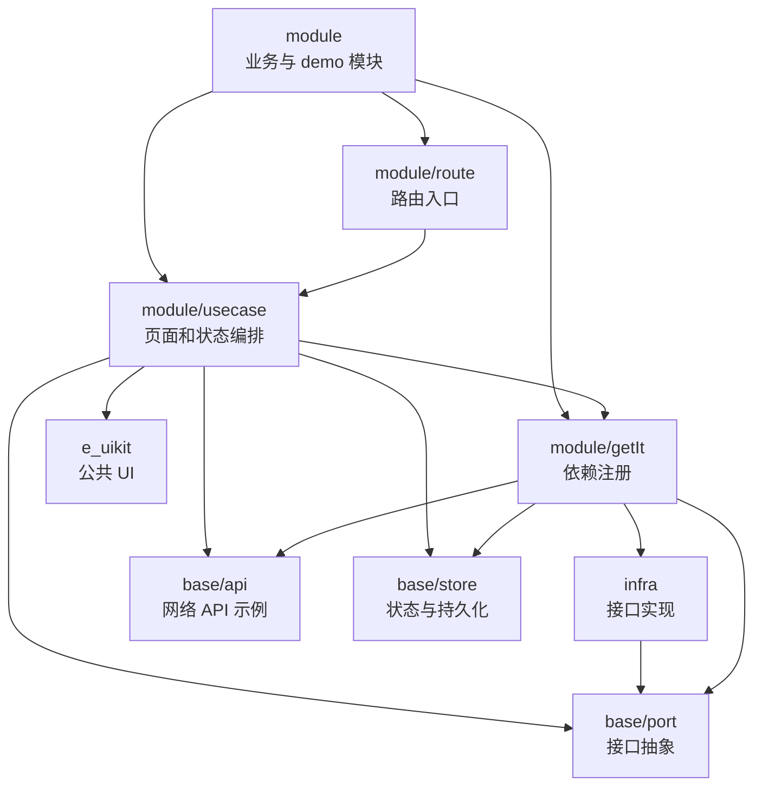

# 分层结构优缺点

本文档用于补充说明 `lib` 当前分层结构的取舍。当前结构把业务模块、接口抽象、基础设施实现、依赖注册、路由和公共 UI 分开，核心目录包括 `module/usecase`、`base/port`、`infra`、`module/getIt`、`module/route`、`e_uikit`。

## 当前层次结构

## 优点

### 1. 业务模块不直接绑定第三方 SDK

`module/usecase` 通过 `base/port` 使用能力，具体 SDK 接入细节放在 `infra`。例如 analytics、feedback、pay 这类能力可以先定义业务需要的接口，再由 `infra` 对接不同 SDK。

这样做的好处是第三方 SDK 替换、初始化方式变化、平台差异处理都不会大面积影响页面和业务模块。

### 2. 职责边界更清楚

每一层都有明确关注点：

- `module/usecase` 关注页面、交互和业务状态编排。
- `base/port` 关注能力抽象。
- `infra` 关注具体实现。
- `module/getIt` 关注依赖注册和装配。
- `module/route` 关注页面入口。
- `e_uikit` 关注可复用 UI。

新功能接入时，可以更快判断代码应该放在哪里，减少页面、SDK、注册逻辑混在一起的问题。

### 3. 更利于测试和替换实现

模块依赖 Port 后，可以在测试中替换为 fake、mock 或 demo 实现。支付、反馈、埋点这类依赖外部环境的能力尤其适合这样处理。

如果实现直接写在页面里，测试时就需要绕过 SDK、网络、平台通道等外部因素，成本会更高。

### 4. 适合逐步扩展第三方能力

当项目中第三方 SDK 逐渐增多时，`base/port` 和 `infra` 的分层能让每种能力有稳定边界。后续新增 `AnalyticsPort`、`FeedbackPort`、`PayPort` 时，可以沿用同一套组织方式。

### 5. 依赖装配集中

`module/getIt` 集中处理对象注册，模块层不用关心具体实现类怎么创建。初始化参数、环境差异、命名实例等装配逻辑可以集中维护。

## 缺点

### 1. 小功能会显得文件更多

一个简单能力可能需要同时新增 Port、Infra 实现、GetIt 注册和模块调用代码。对于 demo 或很小的功能来说，分层会增加文件数量和跳转成本。

### 2. 抽象设计不当会增加理解成本

Port 如果过早抽象、命名不清晰或接口过细，会让调用方很难理解真实能力边界。抽象层应该围绕业务语义设计，而不是简单照搬第三方 SDK 的方法名。

### 3. 依赖注册出错不容易在编译期暴露

使用 `module/getIt` 后，部分依赖缺失、命名实例错误、注册顺序错误可能在运行时才暴露。新增依赖时需要同步维护注册代码和生成代码。

### 4. 需要团队遵守依赖方向

如果模块层绕过 Port 直接调用 `infra` 或第三方 SDK，分层的收益会被削弱。这个结构需要约定：模块依赖抽象，基础设施负责实现，依赖注入负责装配。

### 5. 目录边界需要持续维护

随着功能增加，`base`、`infra`、`module` 都可能变得庞大。需要定期按能力或模块继续拆分子目录，否则外层分层清晰但内部仍然可能混乱。

## 适用场景

这种结构适合以下情况：

- 项目会接入多个第三方 SDK。
- SDK 能力需要在多个模块复用。
- 需要支持不同环境、不同平台或不同实现切换。
- 希望页面和业务模块保持相对干净。
- 希望提高测试时替换外部依赖的能力。

如果只是一次性 demo、不会复用、没有替换需求的小功能，可以先保持简单实现；当能力开始被多个模块复用或第三方接入细节变复杂时，再沉淀到 `base/port` 和 `infra`。

## 推荐实践

- 先从业务语义定义 Port，例如 `trackEvent`、`openFeedback`、`startPayment`，不要直接复制 SDK 的接口形状。
- Infra 实现可以依赖第三方 SDK，但不要让 SDK 类型泄漏到模块层。
- `module/getIt` 注册应靠近实现变更同步维护，避免新增实现后忘记注册。
- `module/usecase` 只负责使用能力，不负责初始化 SDK。
- `e_uikit` 只放通用 UI，不放业务流程和第三方 SDK 调用。
- 当某个目录文件过多时，按能力继续拆分子目录，例如 `infra/analytics`、`infra/pay`、`base/port/pay`。
