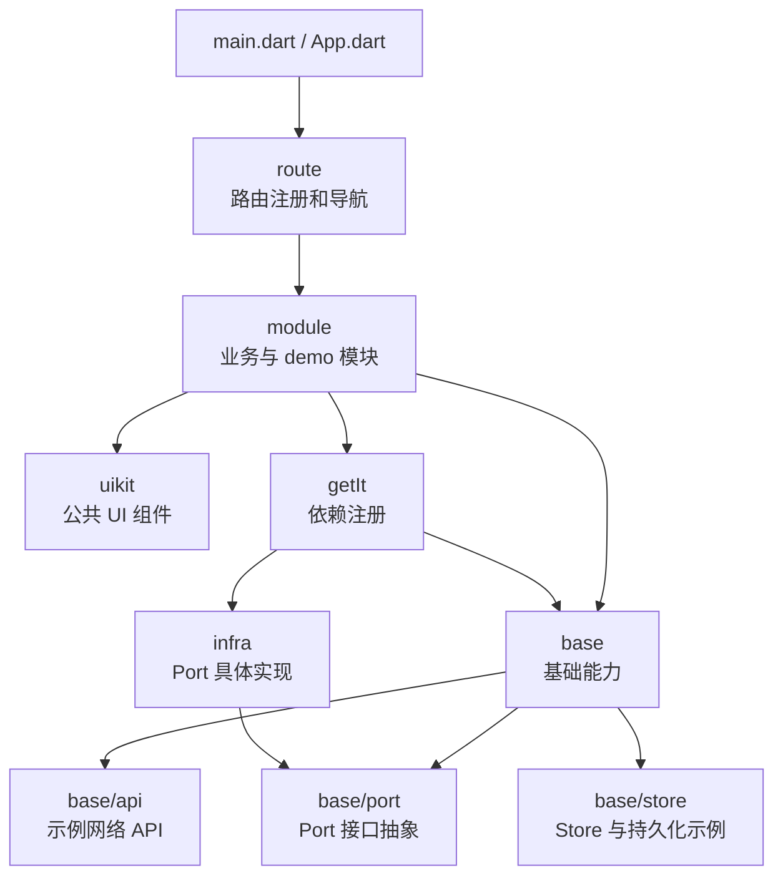

# lib 目录说明

`lib` 是 example 工程的应用入口和示例代码目录，用于展示 `flutter_foundation_kit` 在 Flutter 应用中的接入方式。这里的代码按职责分层：模块页面放在 `module`，接口抽象放在 `base/port`，实现放在 `infra`，依赖注册放在 `getIt`，路由和公共 UI 分别放在 `route`、`uikit`。

## 外层目录职责

- `base`：基础能力目录，包含 Port 抽象、示例 API、Store 等可被模块复用的基础代码。
- `base/port`：接口抽象层。第三方 SDK 接入前，优先在这里定义面向业务的接口，例如 analytics、feedback、pay 等能力的 Port。
- `infra`：基础设施实现层。这里放置 `base/port` 中接口的具体实现，例如对接第三方 SDK、平台能力或远端服务。
- `getIt`：依赖注入注册目录。负责把 Port、Infra、Store、网络客户端等对象注册到 GetIt 容器中。
- `module`：业务或 demo 模块目录。页面、Cubit、VM 和局部组件按模块放在这里。
- `route`：路由和全局导航能力目录。集中维护页面路由表和全局 `NavigatorKey`。
- `uikit`：公共 UI 组件目录。适合放置多个模块共享的 Widget、样式组件和视觉基础设施。

## 结构图

## 推荐依赖方向

模块层通过 `base/port` 中定义的接口使用第三方能力，不直接依赖第三方 SDK。`infra` 负责实现这些接口，并通过 `getIt` 注册给上层使用。这样模块只关心业务语义，第三方 SDK 的初始化、参数转换和平台差异都收敛在基础设施层。
