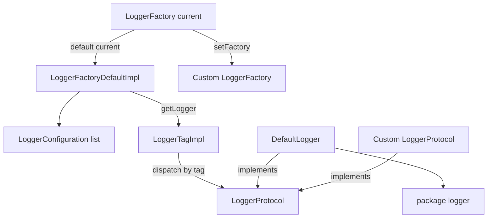
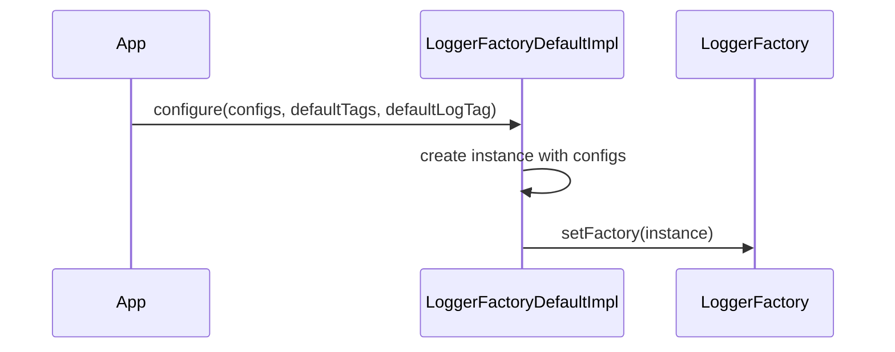
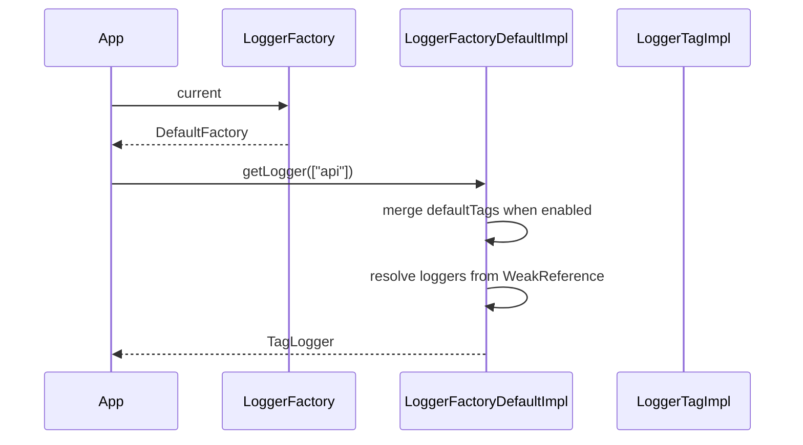
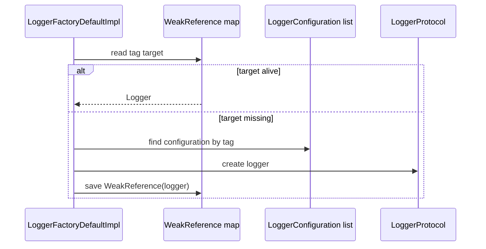
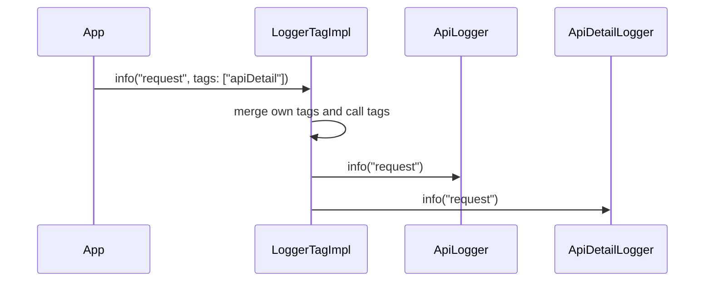
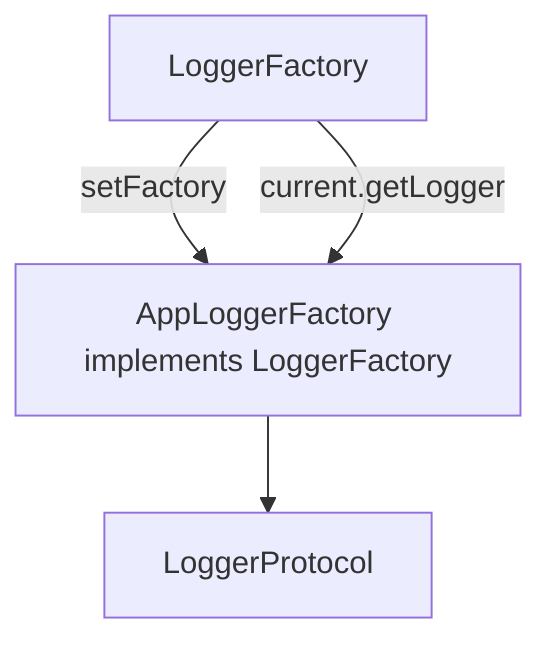

# Logger Process

## 结构图



## 初始化流程



不调用 `configure` 时，`LoggerFactory.current` 已经默认指向一个空配置的 `LoggerFactoryDefaultImpl`，它内置 `console` 配置。

## 获取 Logger



`LoggerFactoryDefaultImpl.getLogger` 返回的是 `LoggerTagImpl`，不是某一个真实 logger。`LoggerTagImpl` 会在真正打印时按 tag 分发。

## 弱引用复用



弱引用 map 只保存已经创建过的 logger。取出来的 `.target` 是强引用对象本身，本次返回的 `LoggerTagImpl` 会强持有本次需要使用的 logger map。

## Tag 合并



例如：

```dart
LoggerFactory.current.getLogger(["api"]).info(
  "request body",
  tags: ["apiDetail"],
);
```

当 `defaultLogTag` 为 `true` 且默认 tags 是 `["console"]` 时，最终会尝试输出到：

```dart
["console", "api", "apiDetail"]
```

## 替换工厂



调用方可以实现自己的 `LoggerFactory`，然后通过 `LoggerFactory.setFactory` 替换默认工厂。业务调用仍然只依赖 `LoggerFactory.current.getLogger()`。
